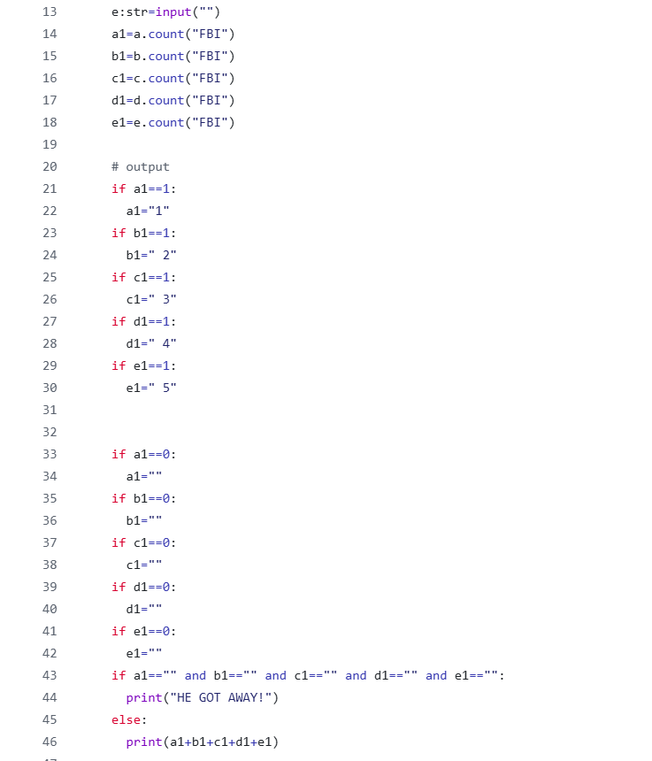

# Competition Repositories

Code | September 2026

## Summary

This artifact is all the code from the various competitions I did, from individual and team competitions alike. I completed all the individual problems in competition 1 and 2, and for the team exercises i did an average of 3 problems for my team, in the hour time limit.

**Project:** Competition Repositories

**My role:** My role was keeping calm under pressure and staying focused on the competition. For my role in the individual problems I had to learn things during the competition that I didn't know before and do it all under a strict time limit. My role in the team problems was working collaboratively with my teammates, and helping each other fix problems.

## The Artifact

[View the full artifact](https://github.com/KaplanTonelli/Code-competition-1)
[and](https://github.com/KaplanTonelli/Coding-competition-2)

## Skills Demonstrated

Data Types
Competition under pressure
Variables

## Tools and Technologies

- [Tool, language, platform, or technology]
- [Tool, language, platform, or technology]
- [Tool, language, platform, or technology]

## Implementation

[Explain how you created this artifact. Describe the major decisions, technical work, problem-solving, testing, troubleshooting, or revisions involved.]

[Include process images if they help explain your work.]

## What I Learned

[Describe what you learned technically or professionally and what you would do differently next time.]

---

[Return to All Artifacts]({{ '/artifacts.html' | relative_url }})