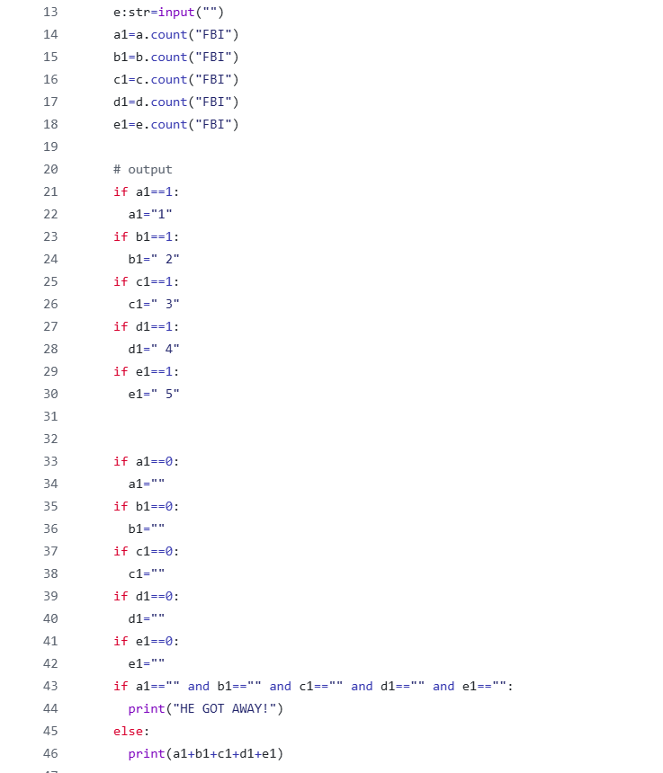

# Competition Repositories

Code | September 2026

## Summary

This artifact is all the code from the various competitions I did, from individual and team competitions alike. I completed all the individual problems in competition 1 and 2, and for the team exercises I did an average of 3 problems for my team, in the hour time limit.

**Project:** Competition Repositories

**My role:** My role was keeping calm under pressure and staying focused on the competition. For my role in the individual problems I had to learn things during the competition that I didn't know before and do it all under a strict time limit. My role in the team problems was working collaboratively with my teammates, and helping each other fix problems.

## The Artifact

[Competition #1](https://github.com/KaplanTonelli/Code-competition-1)
[Competition #2](https://github.com/KaplanTonelli/Coding-competition-2)

## Skills Demonstrated

Data Types
Competition under pressure
Variables

## Tools and Technologies

- Vscode
- Kattis

## Implementation

I worked in collaboration with 2 of my friends to try and complete the coding competitions under a time crunch. 

## What I Learned

For this artifact I learned a lot about working in a team with other people collaboratively. I learned how important it is to work with other people to figure out problems and share different information and ways of doing things. I also learned more about how to code fast under a time limit, and how to move o nif you cant figure something else and let someone else handle it.

---

[Return to All Artifacts]({{ '/artifacts.html' | relative_url }})