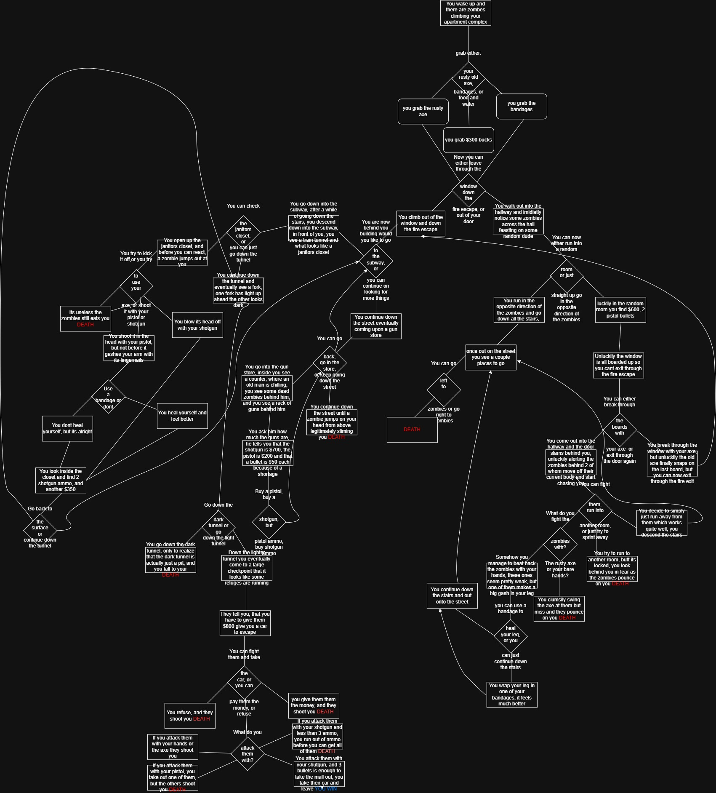

# Artifact Name

PDF | August 2026

## Summary

This artifact is a PDF google docs file of my plan for my interactive experience game. It is part of the larger text adventure project. I mapped out a concept, progression, major choices, and data to track. I also did a flow chart on draw.io

**Project:** Interactive Experience Plan

**My role:** My role in this project was following my teachers instructions and filling out the plan for this project, and do an in-depth diagram on apps.diagrams

## The Artifact

[View the full artifact](Zombie_survival.pdf)

## Skills Demonstrated

Planning
Creative Development

## Tools and Technologies

- [Tool, language, platform, or technology]
- [Tool, language, platform, or technology]
- [Tool, language, platform, or technology]

## Implementation

I created this project by following my teachers instructions by making a copy of a plan PDF, and then I filled in what was needed creating a complete plan for my text adventure game and flow chart.

## What I Learned

For this project I learned a lot about the significance of planning, im happy to say that I worked on this before just diving into my project. I think next time I would not go so in depth into my flow chart as that took a lot of work and I don't think I needed to be so specific.

---

[Return to All Artifacts]({{ '/artifacts.html' | relative_url }})