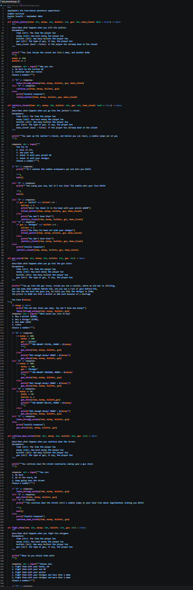

# Text Adventure Code

Code | September 2026

## Summary

This artifact is all the code for my text adventure game, built off of my text adventure plan, it took a lot of time and effort. During this project I helped my friends code as well and did play testing for them, I also spent a lot of time revising and cleaning up the code.

**Project:** Text Adventure Code

**My role:** My role was everything for this project, I didn't have help with anything except for people play testing my game. I did all the code, planning and bug fixing.

## The Artifact

[View the full artifact](https://github.com/KaplanTonelli/Zombie-Survival)

## Skills Demonstrated

Collaboration
Conditionals
Functions

## Tools and Technologies

- VS-Code
- Github
- Python

## Implementation

I first created this artifact by doing the text adventure plan which you can also find in my artifacts, I then learned how to do all the code for this specific type of game. I spent a lot of time coding, revising, coding again, and then having my friends play test it.
After I was done with that I used MagicSchool.ai to tell me how I could make it look cleaner, polish the look up, and make sure there were no spelling errors.

## What I Learned

I learned a lot about the importance of planning, and a lot about Python and VS-Code coding that I didn't know before. I also learned about how to make a text adventure based game and all its elements. Lots of other new knowledge including:
-How useful play testing is
- How to polish and make code more understandable
- How to get help from people working on the same project as you

---

[Return to All Artifacts]({{ '/artifacts.html' | relative_url }})